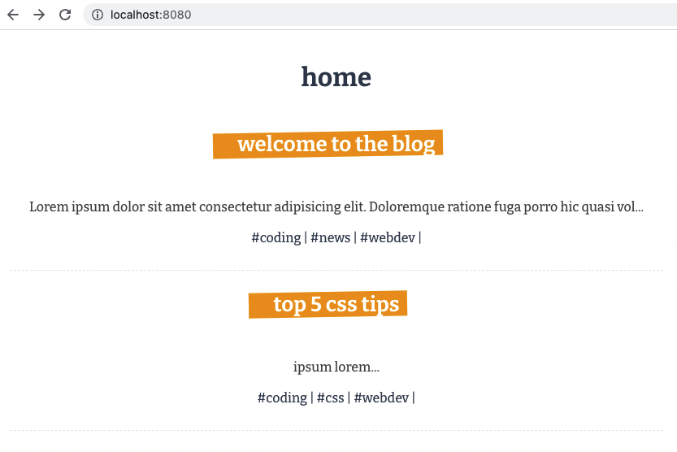
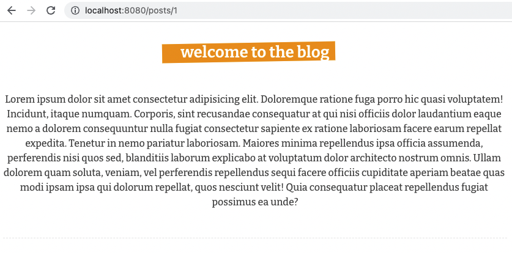

# Vue 3 CLI - Simple Blog with JSON Server

## What is this about?
- have an overview page (home) with x blog previews
- click on blog headline to get to blog detail page
- working with `props` in the `setup()` function which is provided by the Composition API
- locally installing JSON Server package https://www.npmjs.com/package/json-server `npm install json-server` to mock getting data from an external data base
- running JSON Server and having it watch the file you want to watch `npx json-server --watch data/db.json`
- this project only has the bare minimum regarding styling, focus is on understanding Vue

## Tech Stack
- Vue 3 with Vue Router
- HTML, SCSS, JavaScript
- JSON Server

## Source
- [The Net Ninja - Vue JS 3 Tutorial for Beginners #11 - The Composition API (part 2)](https://www.youtube.com/watch?v=0FwBjPeLqQ8&list=PL4cUxeGkcC9hYYGbV60Vq3IXYNfDk8At1&index=12)
- [GitHub result branch](https://github.com/iamshaunjp/Vue-3-Firebase/tree/lesson-100) BUT not all of the code you find there is covered in the free VT course! The missing rest is apparently covered in the Udemy course; this project here only covers the "free" stuff

## How to run this?
- clone the repo
- cd into project
- `npm install` to prepare the project setup
- `npm run serve` to compile and hot-reaload for development, this will generally fire up the server at http://localhost:8080/ (or the next availble number)
- `npm run build` to compile and minify for production
- `npm run lint` to lint and fix files
- `control c` to properly stop the server

### Customize configuration
See [Configuration Reference](https://cli.vuejs.org/config/).
